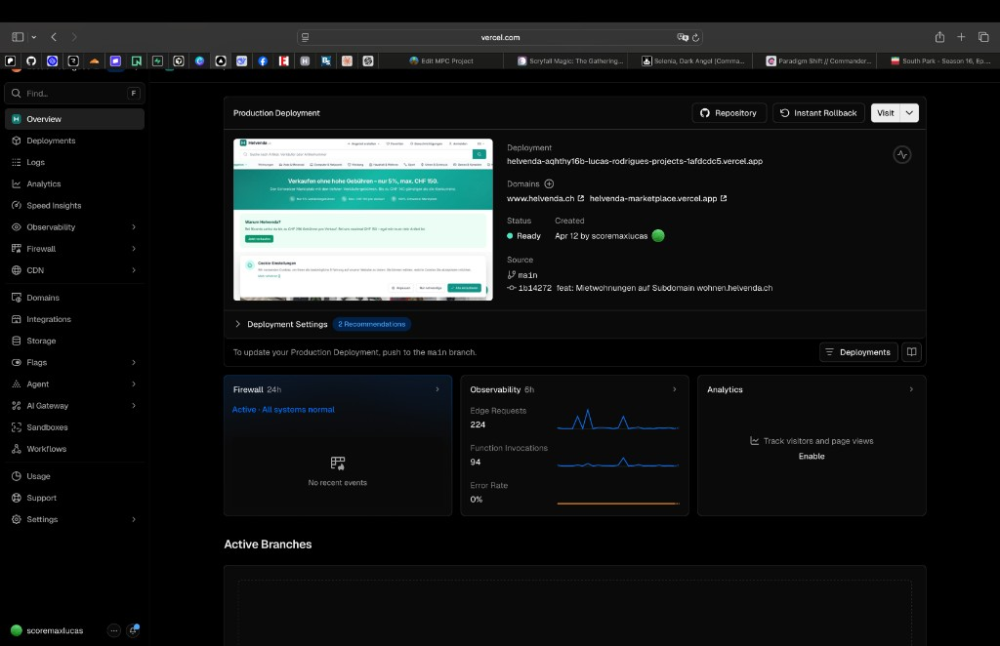
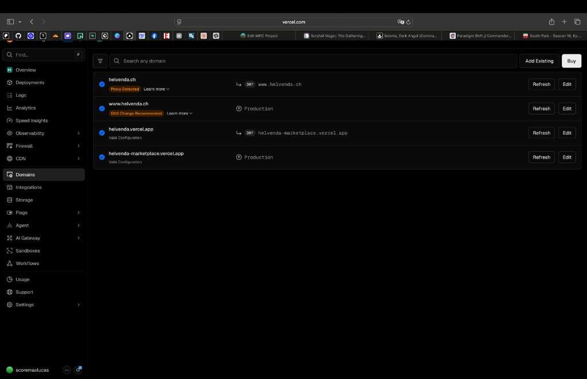

# DNS & Vercel: `wohnen.helvenda.ch` einrichten (Helvenda Mietwohnungen)

**Automatisch beim Öffnen des Repos:** siehe [_DNS_WOHNEN_AUTOOPEN.md](../_DNS_WOHNEN_AUTOOPEN.md) und die Task „Helvenda: DNS-Anleitung …“ in [.vscode/tasks.json](../.vscode/tasks.json) (`runOn: folderOpen`).

Kopierbare Anleitung für das Team. Enthält **verifizierte öffentliche DNS-Daten** (Zone `helvenda.ch`) und die **Vercel-Oberfläche** wie in euren Screenshots unter `docs/images/`.

## Vercel in eurem Projekt (Referenz-Screenshots)

**Projekt-Übersicht** — Domains-Karte mit `www.helvenda.ch`; über das **Plus (+)** neben „Domains“ oder über die Sidebar gelangt ihr zur Domain-Verwaltung:

**Settings → Domains** — dort verwaltet ihr alle Hostnamen. Button **„Add Existing“** nutzen, um **`wohnen.helvenda.ch`** hinzuzufügen:

Aktuell sichtbar in den Screenshots u. a.:

| Domain | Hinweis aus Vercel |
|--------|---------------------|
| `helvenda.ch` | **Proxy Detected** — oft Cloudflare (orange Wolke) vor Vercel. Redirect **307** → `www.helvenda.ch`. |
| `www.helvenda.ch` | **DNS Change Recommended** — Vercel schlägt oft eine klarere CNAME-Konfiguration vor; trotzdem **Production**. |
| `helvenda-marketplace.vercel.app` | **Valid Configuration**, Production. |

**`wohnen.helvenda.ch`** müsst ihr **explizit** unter Domains hinzufügen, wenn die Mietwohnungen-Subdomain auf **dieselbe** Next.js-Production zeigen soll — sie erscheint nicht automatisch durch Git-Commits.

---

## Wichtig: Kein automatischer Zugriff auf euer Vercel-Konto

Diese Anleitung basiert auf **Vercel-Dokumentation**, **öffentlicher DNS-Auflösung** und **euren Screenshots**. Die **exakte** DNS-Zeile (Ziel-Host) steht immer in **Vercel → Project → Settings → Domains**, sobald ihr die Domain hinzufügt — dort **1:1 kopieren**.

Offizielle Doku: [Working with DNS (Vercel)](https://vercel.com/docs/domains/working-with-dns)

---

## Verifizierter öffentlicher DNS-Stand (`helvenda.ch`)

Abgefragt via öffentlicher Resolver (Google Public DNS API), Stand bei Erstellung dieser Anleitung:

| Abfrage | Ergebnis |
|---------|----------|
| **NS** für `helvenda.ch` | `amos.ns.cloudflare.com`, `magnolia.ns.cloudflare.com` |
| **CNAME** für `www.helvenda.ch` | `cname.vercel-dns.com.` |

**Konsequenz:** Die **autoritative** Zone für `helvenda.ch` liegt bei **Cloudflare**. DNS für **`wohnen`** stellt ihr dort ein (Host-Name meist **`wohnen`**, Typ **CNAME**, Ziel wie Vercel es vorgibt — in der Regel **`cname.vercel-dns.com`**, analog zu `www`).

Einträge nur in **Metanet** wirken für das Internet **nur**, wenn die Domain **tatsächlich** auf Metanet-Nameserver zeigt — öffentlich war die Zone **Cloudflare**, nicht Metanet.

---

## Schritt 1 — Domain in Vercel anlegen

1. [vercel.com](https://vercel.com) → Projekt **Helvenda** öffnen (gleiches Deployment wie `www.helvenda.ch` / `helvenda-marketplace.vercel.app`).
2. **Settings** → **Domains**.
3. **Add Existing** → **`wohnen.helvenda.ch`** eingeben → bestätigen.
4. Vercel zeigt die **konkrete DNS-Anweisung** (fast immer **CNAME** `wohnen` → `cname.vercel-dns.com` oder ein dort angezeigtes Ziel — **exakt übernehmen**).
5. Warten, bis der Status **Valid** wird und SSL aktiv ist.

Ohne diesen Schritt ist **`wohnen.helvenda.ch`** diesem Projekt nicht zugeordnet.

---

## Schritt 2 — DNS bei Cloudflare setzen

1. [dash.cloudflare.com](https://dash.cloudflare.com) → Zone **`helvenda.ch`**.
2. **DNS** → **Records**.
3. Eintrag für **`wohnen`**:
   - **Type:** `CNAME`
   - **Name:** `wohnen`
   - **Target:** genau der Wert aus **Vercel → Domains** (praktisch sicher wie bei `www`: `cname.vercel-dns.com`).
4. **Proxy (orange Wolke):** **DNS only (grau)** oder **Proxied (orange)** — bei Orange in Cloudflare **SSL/TLS** prüfen (oft **Full (strict)** mit Vercel).
5. Keine widersprüchlichen doppelten Einträge für `wohnen`.

**Nicht** als Ziel nur `helvenda.ch` setzen, wenn Vercel **`cname.vercel-dns.com`** verlangt.

---

## Schritt 3 — Vercel-Warnungen („DNS Change Recommended“, „Proxy Detected“)

- **DNS Change Recommended** (bei `www`): In Vercel **Learn more** / **Edit** und empfohlene Konfiguration übernehmen.
- **Proxy Detected:** Hinweis auf Proxy vor Vercel — SSL-Modus und CNAME müssen zu Vercel passen.

---

## Schritt 4 — Metanet

Nur relevant, wenn **Nameserver = Metanet** und die Zone dort autoritativ ist. Sonst DNS in **Cloudflare** (siehe oben).

---

## Schritt 5 — Google OAuth (falls aktiv)

In der Google Cloud Console beim OAuth-Client ergänzen:

- **Authorized redirect URIs:** `https://wohnen.helvenda.ch/api/auth/callback/google`
- **Authorized JavaScript origins:** `https://wohnen.helvenda.ch`

---

## Schritt 6 — Repo & Env (bereits vorbereitet im Code)

Im Repository gibt es Host-Routing für **`wohnen.helvenda.ch`** in [`src/middleware.ts`](../src/middleware.ts) sowie `NEXT_PUBLIC_WOHNEN_URL` (Fallback `https://wohnen.helvenda.ch`) wo nötig.

**Vercel Production Environment Variables (optional / empfohlen):**

- `NEXT_PUBLIC_WOHNEN_URL` = `https://wohnen.helvenda.ch`

---

## Checkliste

- [ ] **`wohnen.helvenda.ch`** unter **Vercel → Settings → Domains** mit **Add Existing** hinzugefügt  
- [ ] DNS-Ziel aus Vercel kopiert  
- [ ] In **Cloudflare** CNAME **`wohnen`** → Vercel-Ziel (analog `www`)  
- [ ] Vercel-Status **Valid**  
- [ ] Browser: **`https://wohnen.helvenda.ch`** mit gültigem Zertifikat  
- [ ] Google OAuth für **`wohnen`** (falls genutzt)  
- [ ] Optional: `NEXT_PUBLIC_WOHNEN_URL` in Vercel setzen  

---

## Troubleshooting

- [Vercel: Domains troubleshooting](https://vercel.com/docs/domains/troubleshooting)  
- Propagation: [whatsmydns.net – CNAME wohnen.helvenda.ch](https://www.whatsmydns.net/#CNAME/wohnen.helvenda.ch)  

---

*Anleitung inkl. Screenshots unter `docs/images/`; Fokus: **wohnen.helvenda.ch** (Mietwohnungen-Subdomain), nicht `home.helvenda.ch`.*
